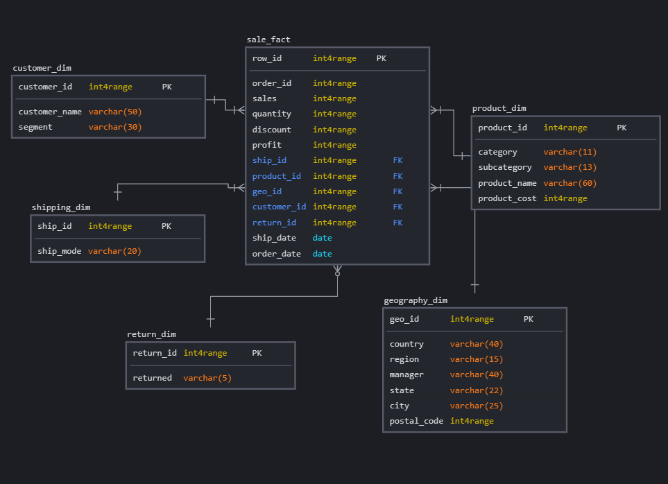

# SQL
SQL is the most dominant language for data operations in data engineering. Data engineers use SQL to make data accessible for querying, collect raw data, clean it, model it, and let end-users access the clean data. So, to progress further I decided to took [SQL course from learndb.ru](https://learndb.ru/courses) for about a month and [here](../SQL/learndb|learndb) lies practice part of that course.

# Database installation
- Installed [PostgreSQL](https://www.postgresql.org/download/) database;
- Installed [DBeaver](https://dbeaver.io/download/) - database management tool.
# Connection to Database and SQL queries practice
- Created new database in PostgreSQL;
- Used [orders](https://github.com/atsterq/DE-101/blob/main/Module2/2.3/create_orders_table.sql), [people](https://github.com/atsterq/DE-101/blob/main/Module2/2.3/create_people_table.sql) and [returns](https://github.com/atsterq/DE-101/blob/main/Module2/2.3/create_returns_table.sql) SQL scripts to create relevant tables;
- To overview given dataset wrote [SQL queries](https://github.com/atsterq/DE-101/blob/main/Module2/2.3/overview.sql), showing the following metrics:
  - Total Sales;
  - Total Profit;
  - Profit Ratio;
  - Profit per Order;
  - Sales per Customer;
  - Avg. Discount;
  - Monthly Sales by Segment;
  - Monthly Sales by Product Category;
  - Sales by Product Category over time;
  - Sales and Profit by Customer;
  - Customer Ranking;
  - Sales per region.

# Draw data model in SQLdbm
I'm going to use [sqldbm](https://app.sqldbm.com/) to create data models, but many other options are viable.  

- Given asset of data (superstore) is represented by this data model:
[[2.4/old_model.png]]

- So on this basis I created this logical data model with corresponding relations: 

- Then forward engineered graphical logical model into [sql query](2.4/create_dw_tables.sql).
# Draw charts in Google Sheets

# Draw graphs in KlipFolio
